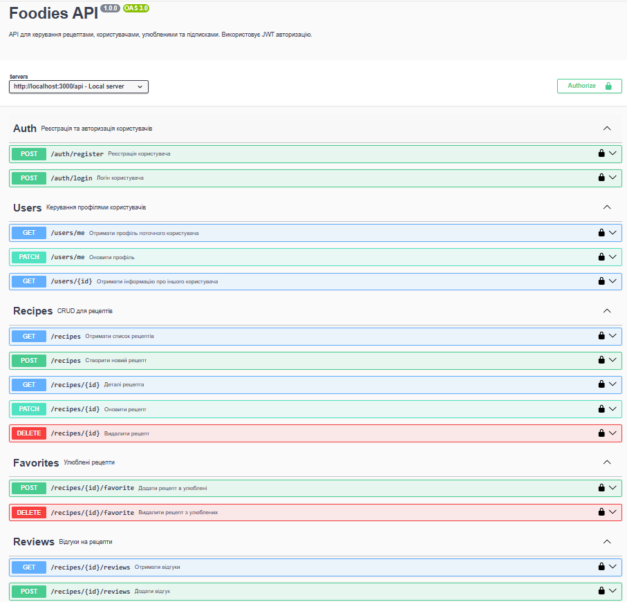
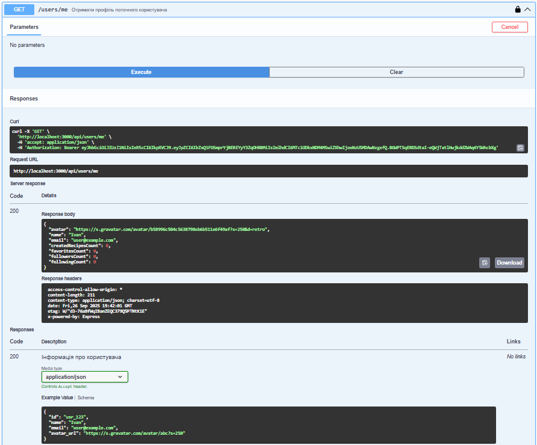
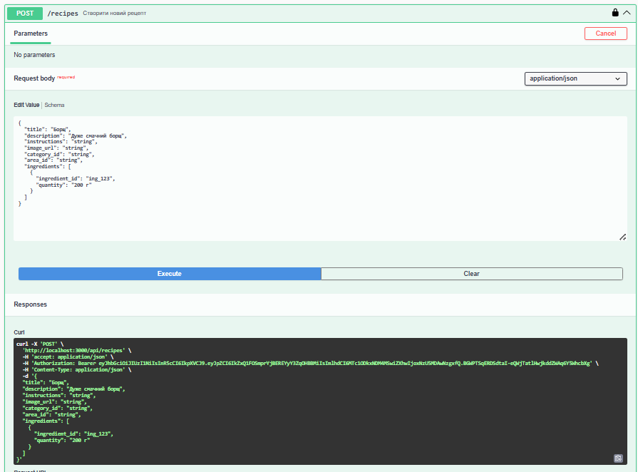
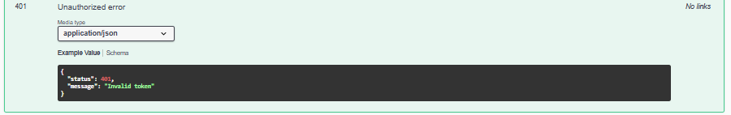

# Foodies API – Swagger Guide

## Як працювати з API документацією (Swagger + ReDocly)

## Що таке Swagger?

Swagger (OpenAPI) — це інтерактивна документація для API.  
Вона дозволяє:

- бачити всі доступні **ендпоінти бекенду**,
- запускати їх прямо в браузері,
- швидко тестувати запити без Postman/Insomnia,
- зрозуміти, які параметри потрібні для кожного запиту.

## Як працювати з документацією

1. Запуск сервера з Swagger UI

npm run docs:dev

Ця команда робить два кроки:

Збирає документацію (openapi.yaml + paths/_.yaml + components/_.yaml) у єдиний файл docs/swagger.json.

Запускає бекенд (nodemon server.js) з підключеним Swagger UI.

2. Відкрити документацію

Swagger UI доступний тут:
👉 http://localhost:3000/api-docs

🗂 Структура документації
docs/
├─ openapi.yaml # головний файл з інформацією про API
├─ components/ # повторно використовувані частини
│ ├─ schemas.yaml # моделі даних (User, Recipe, Review)
│ └─ responses.yaml # стандартні відповіді (401, 404)
└─ paths/ # ендпоінти (групи по ресурсах)
├─ auth.yaml # /auth/_
├─ users.yaml # /users/_
├─ recipes.yaml # /recipes/_
└─ reviews.yaml # /recipes/{id}/reviews/_

🔹 openapi.yaml

Містить:

info — загальна інформація (назва, версія);

servers — базовий URL API;

tags — категорії ендпоінтів;

paths — посилання на окремі YAML файли з описами ($ref: ./paths/...);

components — глобальні схеми авторизації.

🔹 components/schemas.yaml

Описує всі моделі даних (User, Recipe, Review, LoginRequest, AuthResponse і т.д.).

🔹 components/responses.yaml

Повторно використовувані відповіді сервера (401, 404 і т.д.).

🔹 paths/\*.yaml

Кожен файл містить ендпоінти певного ресурсу.
Наприклад, paths/auth.yaml описує /auth/register і /auth/login.

## Головна сторінка Swagger UI

✅ Тепер усі запити з security: bearerAuth будуть автоматично додавати токен.

## Приклади запиту у Swagger

### Реєстрація користувача

POST /auth/register

{
"email": "user@example.com",
"password": "secret123",
"name": "Ivan"
}

### Логін

## 🔑 Авторизація (JWT)

Виконай POST /auth/register або POST /auth/login, щоб отримати token.

Скопіюй token із відповіді.

У Swagger UI натисни кнопку Authorize.

Встав Bearer <твій_token> і натисни Authorize → Close.

POST /auth/login

{
"email": "user@example.com",
"password": "secret123"
}

📌 Відповідь:

{
"token": "jwt_token_here",
"user": { "id": "abc123", "email": "user@example.com", "name": "Ivan" }
}

## Приклад відповіді

### Отримати профіль

GET /users/me

Вимагає авторизації (Bearer token).

## Приклад відповіді

### Створити рецепт

POST /recipes

{
"title": "Borshch",
"description": "Український борщ",
"instructions": "Зварити...",
"image_url": "https://example.com/image.jpg",
"category_id": "cat1",
"ingredients": [
{ "ingredient_id": "ing1", "quantity": "2 pcs" }
]
}

## Приклад

### Типові помилки

401 Unauthorized → не додано Bearer token або токен прострочений.

404 Not Found → ресурс із таким ID не існує.

400 Bad Request → не передані обов’язкові поля у requestBody.

## Приклад 401 помилки

### 📖 FAQ

❓ Swagger не показує оновлення

👉 Виконай:

npm run build-docs
npm run dev

❓ Чому після реєстрації я не можу зробити /users/me?

👉 Використай token з відповіді /auth/login.

❓ Чи можна запускати Swagger без бекенду?

👉 Ні, Swagger UI підтягує дані з API.

### 📌 Корисні команди

Зібрати документацію:

npm run build-docs

Запустити прев’ю документації (hot reload):

npm run preview-docs

Запустити бекенд + Swagger:

npm run docs:dev
